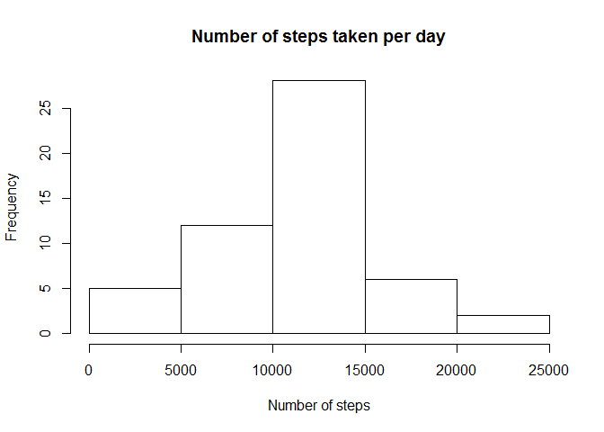
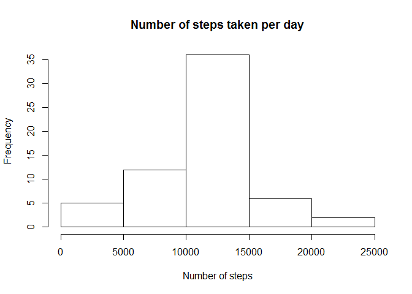
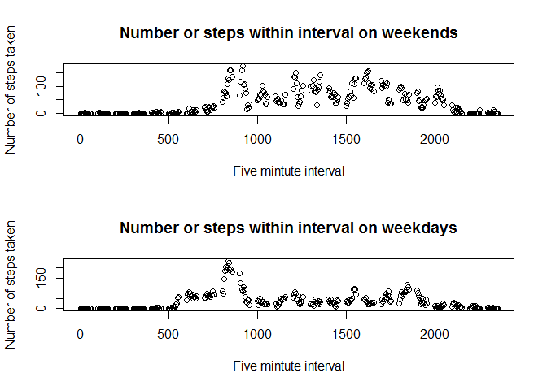

# Reproducible Research: Peer Assessment 1


## Loading and preprocessing the data
First, read in the data, and format the dates.
Then, create a new data frame with the count of the number of steps taken each 
day. Finally, calculate averages by the interval.

```r
fitnessData <- read.csv("activity.csv")
fitnessData$date <- as.Date(fitnessData$date, format = "%Y-%m-%d")
fitnessByDay <- aggregate(steps ~ date, data=fitnessData, FUN=sum)
fitnessByInterval <- aggregate(steps ~ interval, data=fitnessData, FUN=mean)
```


## What is mean total number of steps taken per day?
First, present a histogram of the number of steps taken per day.

Second, calculate the mean (ignore NA's).

Third, calculate the median (ignore NA's).

```r
# the default is scientific notation... change to decimal places
options(scipen = 1, digits = 2)
hist(fitnessByDay$steps, 
                        main = "Number of steps taken per day", 
                        xlab = "Number of steps")
```

 

```r
meanDailySteps <- round(as.numeric(mean(fitnessByDay$steps,na.rm=T)),1)
medianDailySteps <- round(as.numeric(median(fitnessByDay$steps,na.rm=T)),1)
```
The mean daily steps was: 10766.2

The median daily steps was: 10765

## What is the average daily activity pattern?
Make a time series plot of the 5 minute interval averged across all days.
Also find the interval with the most steps.

```r
plot(fitnessByInterval, xlab = "Five mintute interval", 
                        ylab="Number of steps taken",
                        main = "Number or steps within interval")
```

 

```r
maxSteps <- max(fitnessByInterval$steps)
maxIntervalIndex <- which(fitnessByInterval$steps==maxSteps)
maxInterval <- fitnessByInterval[maxIntervalIndex,]$interval
```
The interval with the most average steps was 835 with 206.17 
steps taken on average.

## Imputing missing values
Fill in any missing values using the mean value of the non-missing for the 
given interval.

```r
# First make a new data frame
fitnessData_imputed <- fitnessData
missingSteps <- is.na(fitnessData_imputed$steps)
for (i in 1:length(missingSteps)){
         if (missingSteps[i]){
                 interval <- fitnessData_imputed[i,]$interval
                 intervalIndex <- which(fitnessByInterval$interval == interval)
                 fitnessData_imputed[i,]$steps <- 
                        fitnessByInterval[intervalIndex ,]$steps
         }
} 
```
Print the histogram, mean, and median, to see the difference using the 
imputation.

```r
fitnessByDay_imputed <- aggregate(steps ~ date, data=fitnessData_imputed, FUN=sum)
hist(fitnessByDay_imputed$steps, 
                        main = "Number of steps taken per day", 
                        xlab = "Number of steps")
```

 

```r
meanDailySteps_imputed <- round(as.numeric(mean(fitnessByDay_imputed$steps,na.rm=T)),1)
medianDailySteps_imputed <- round(as.numeric(median(fitnessByDay_imputed$steps,na.rm=T)),1)
```
The mean daily steps using imputed data was: 10766.2

The median daily steps using imputed data was: 10766.2

As a result of using imputed data, the median was slightly higher. The mean
was exactly the same. The histogram included more observations, and as a result,
imputing the missing values resulted in a higher count of daily steps.


## Are there differences in activity patterns between weekdays and weekends?
First, find out if a date falls on a weekday or weekend.
Second, plot out the average steps by interval on weekdays and weekends.

```r
fitnessData$dayOfWeek <- weekdays(fitnessData$date)
fitnessData$weekend <- fitnessData$dayOfWeek %in% c("Saturday", "Sunday")

fitnessByInterval_weekend <- aggregate(steps ~ interval, 
                                       data=fitnessData, 
                                       FUN=mean,
                                       subset = weekend)

fitnessByInterval_weekday <- aggregate(steps ~ interval, 
                                       data=fitnessData, 
                                       FUN=mean,
                                       subset = !weekend)
par(mfrow=c(2,1))
plot(fitnessByInterval_weekend, xlab = "Five mintute interval", 
                        ylab="Number of steps taken",
                        main = "Number or steps within interval on weekends")
plot(fitnessByInterval_weekday, xlab = "Five mintute interval", 
                        ylab="Number of steps taken",
                        main = "Number or steps within interval on weekdays")
```

 

In general, there is more activity on weekends. Activity starts earlier on 
weekdays, but is more subdued throughout the day. Activities end later on 
weekends.
