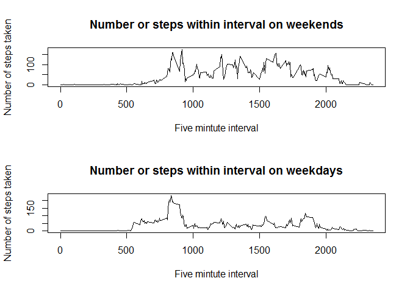

# Reproducible Research: Peer Assessment 1
streckereck  


## Loading and preprocessing the data

```r
# unzip
unzip("activity.zip")

# read in
fitnessData <- read.csv("activity.csv")

# format dates
fitnessData$date <- as.Date(fitnessData$date, format = "%Y-%m-%d")
```


## What is mean total number of steps taken per day?

```r
# the default is scientific notation... change to decimal places
options(scipen = 1, digits = 2)

# sum the number of steps per day
fitnessByDay <- aggregate(steps ~ date, data=fitnessData, FUN=sum)

# histogram of steps per day
hist(fitnessByDay$steps, 
                        main = "Number of steps taken per day", 
                        xlab = "Number of steps")
```

 

```r
# caclulate the mean and median, round to one decimal place
meanDailySteps <- round(as.numeric(mean(fitnessByDay$steps,na.rm=T)),1)
medianDailySteps <- round(as.numeric(median(fitnessByDay$steps,na.rm=T)),1)
```
The mean daily steps was: 10766.2

The median daily steps was: 10765

## What is the average daily activity pattern?

```r
# find the average steps per 5 min interval
fitnessByInterval <- aggregate(steps ~ interval, data=fitnessData, FUN=mean)

plot(fitnessByInterval, xlab = "Five mintute interval", 
                        ylab="Number of steps taken",
                        main = "Number or steps within interval",
                        type = "l")
```

 

```r
# find the maximum number of steps
maxSteps <- max(fitnessByInterval$steps)

# find the index(row number) of the interval with the maximum steps
maxIntervalIndex <- which(fitnessByInterval$steps==maxSteps)

# find the interval number with the maximum number of steps
maxInterval <- fitnessByInterval[maxIntervalIndex,]$interval
```
The interval with the most average steps was 835 with 206.17 
steps taken on average.

## Imputing missing values
Fill in any missing values using the mean value of the non-missing observations
for the given interval.

```r
# First make a new data frame
fitnessData_imputed <- fitnessData

# make a logical list of which rows are missing data
missingSteps <- is.na(fitnessData_imputed$steps)

# loop through the data frame. Where the number of steps is missing,
# imput the value using the mean of the interval.
for (i in 1:length(missingSteps)){
         if (missingSteps[i]){
                 interval <- fitnessData_imputed[i,]$interval
                 intervalIndex <- which(fitnessByInterval$interval == interval)
                 fitnessData_imputed[i,]$steps <- 
                        fitnessByInterval[intervalIndex ,]$steps
         }
} 
```

Print the histogram, mean, and median, to see the difference using the 
imputation.


```r
# sum the number of steps per day with the imputed data
fitnessByDay_imputed <- aggregate(steps ~ date, data=fitnessData_imputed, FUN=sum)

# make a histogram
hist(fitnessByDay_imputed$steps, 
                        main = "Number of steps taken per day", 
                        xlab = "Number of steps")
```

 

```r
#calculate the mean and median
meanDailySteps_imputed <- round(as.numeric(mean(fitnessByDay_imputed$steps,na.rm=T)),1)
medianDailySteps_imputed <- round(as.numeric(median(fitnessByDay_imputed$steps,na.rm=T)),1)
```

The mean daily steps using imputed data was: 10766.2

The median daily steps using imputed data was: 10766.2

As a result of using imputed data: 

* The median was slightly higher. 
* The mean was exactly the same (since the mean by interval was used for the 
imputation). 
* The histogram included more observations (indicated by a 
greater range of values on the y-axis).
* There was a slight positive shift in the distribution (indicated by the higher 
median value)
* Imputing the missing values does increase the total number of steps taken 
(since it fills in missing values), it does not affect the mean daily steps, and
there is only a slight positive shift in the distribution.

## Are there differences in activity patterns between weekdays and weekends?

```r
# find the day of week
fitnessData$dayOfWeek <- weekdays(fitnessData$date)

# find weekend days
fitnessData$weekend <- fitnessData$dayOfWeek %in% c("Saturday", "Sunday")

# find the mean by interval for both weekends and weekdays
fitnessByInterval_weekend <- aggregate(steps ~ interval, 
                                       data=fitnessData, 
                                       FUN=mean,
                                       subset = weekend)

fitnessByInterval_weekday <- aggregate(steps ~ interval, 
                                       data=fitnessData, 
                                       FUN=mean,
                                       subset = !weekend)

# plot out the average number of steps per interval 
par(mfrow=c(2,1))
plot(fitnessByInterval_weekend, xlab = "Five mintute interval", 
                        ylab="Number of steps taken",
                        main = "Number or steps within interval on weekends",
                        type="l")
plot(fitnessByInterval_weekday, xlab = "Five mintute interval", 
                        ylab="Number of steps taken",
                        main = "Number or steps within interval on weekdays",
                        type="l")
```

 

In general, there is more activity on weekends. Activity starts earlier on 
weekdays, but is more subdued throughout the day. Activities end later on 
weekends.
